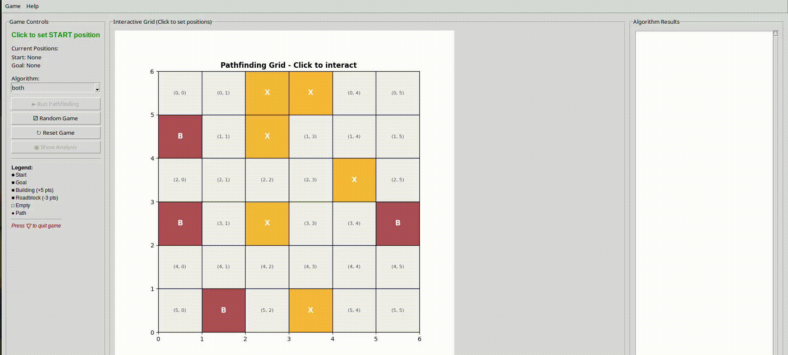
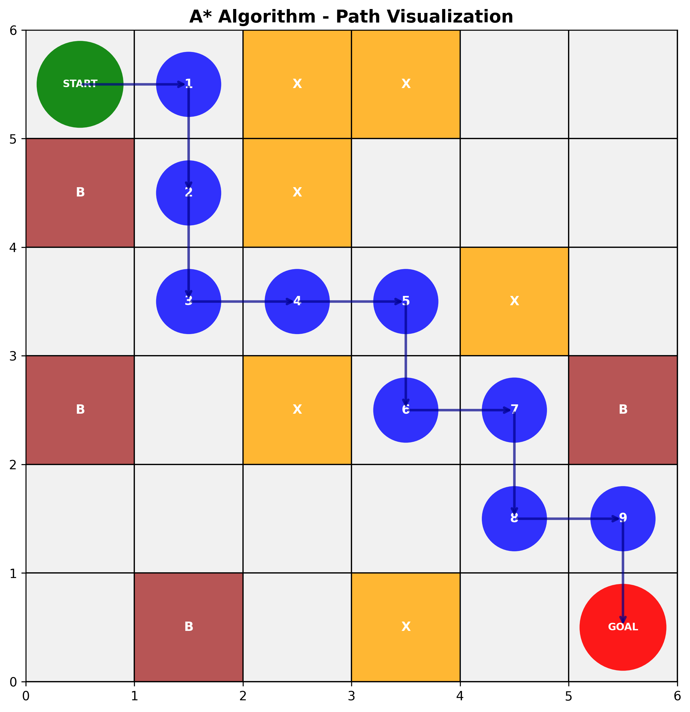
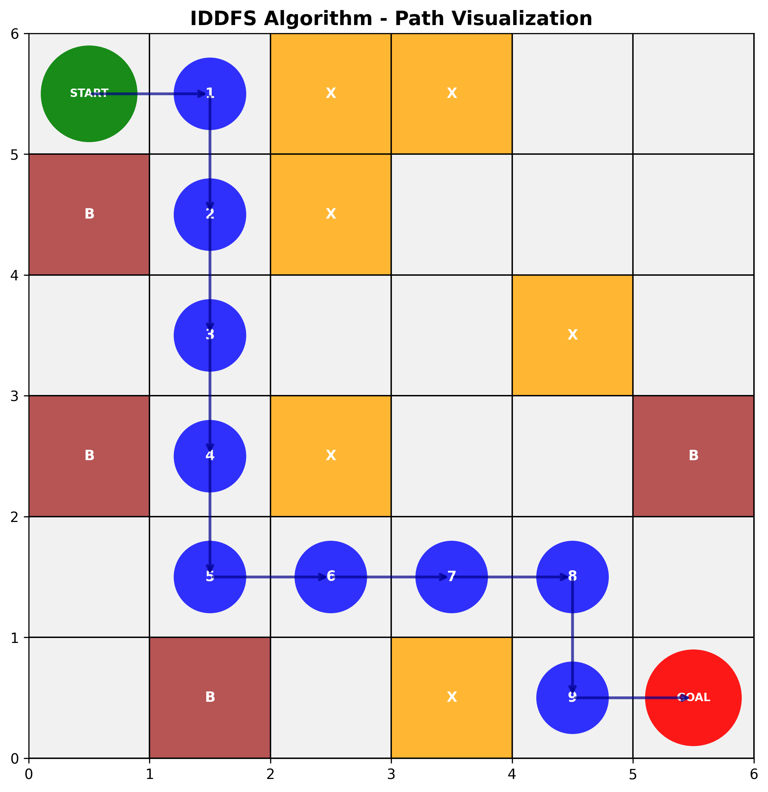
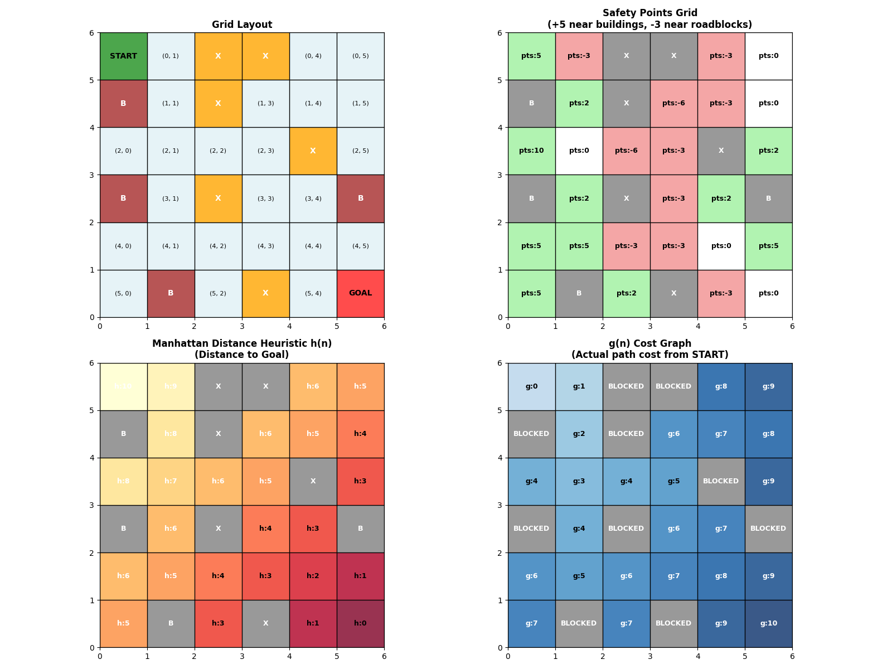

# Grid Gaming - Interactive Pathfinding Game

Interactive educational game demonstrating A* and IDDFS pathfinding algorithms with animated visualization.

## Demo



## Quick Start

```bash
# Setup environment
./setup_game.sh

# Run game  
./run_game.sh
```

## Features

- Interactive pathfinding with A* and IDDFS algorithms
- Real-time path animation and safety analysis
- Educational g(n) cost visualization
- Press 'Q' to quit

## Requirements

- Python 3.8+
- tkinter, matplotlib, numpy

## Visualization Gallery

### Pathfinding Algorithm Demonstrations

**A* Algorithm Path Visualization:**


**IDDFS Algorithm Path Visualization:**


**Grid Analysis:**

